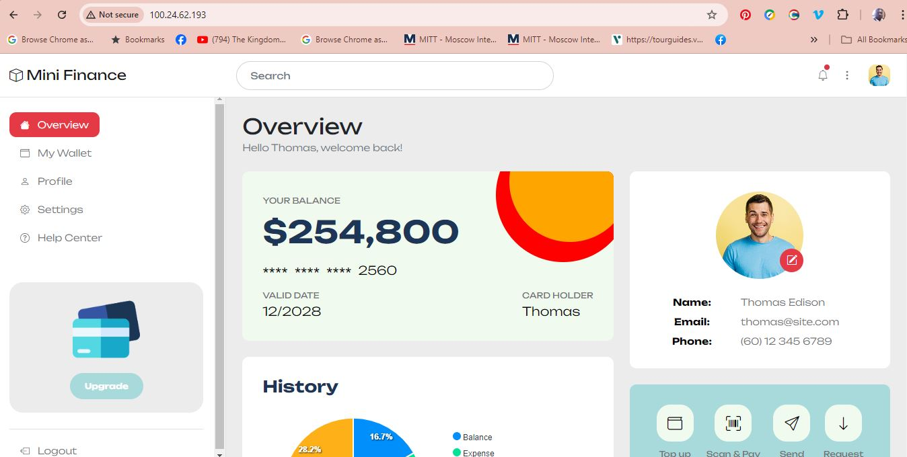

# Introduction

This is my 3rd project. In this project, I will be setting up load balancing for static websites using Nginx. This project involved configuring Nginx as a load balancer to distribute traffic across multiple servers, enhancing sustainerbility, reliability and availability.

# Type of Load Balancer

This time I am using Nginx as a reverse proxy load balancer, which helps distribute incoming client requests evenly across multiple servers.

# Step 1: Deploying Three Servers

I successfully set up 3 EC2 instances running Ubuntu. Instances 1 (financial) and 2 (Interiors) will host a static website, while the nos 3 (Loadbal) will function as a load balancer, routing traffic between the two web servers.

# Step 2: Setting Up Static Websites and configuring the load balancer

I successfully installed Nginx using the following codes 

A. sudo apt update

B. sudo apt upgrade

C. sudo apt install nginx

D. sudo systemctl start nginx

E. I dowmloaded the zip file of two different HTML template Sites and configured each server to host the 2 distinct HTML content, ensuring they could be differentiated when accessed.

I successfully set up the load balancer configuration to distribute requests between the two website servers using a round-robin method using this code, sudo vim /etc/nginx/nginx.conf

I edited the block in http path replacing all that is neccessary.

# Step 3: DNS Configuration and Validation

I added an A record for the load balancer in DNS to allow public access

In Route 53, I pointed my domain to the IP of the Nginx load balancer server.

# Step 4: Securing the Websites with SSL/TLS

1.	I ran Certbot on the load balancer server to obtain and configure SSL certificates for the domain using the code, sudo certbot --nginx 

# Conclusion

Setting up a load balancer using Nginx was an eye opening experience. I  look forward with more confidence to applying this experiences to solving real world problems for SMEs.
